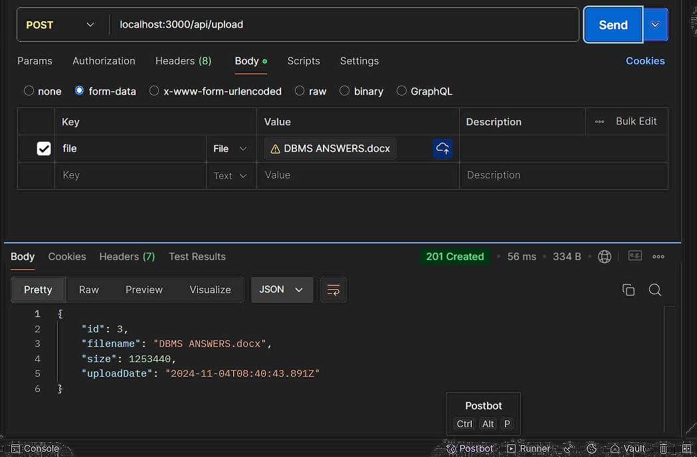
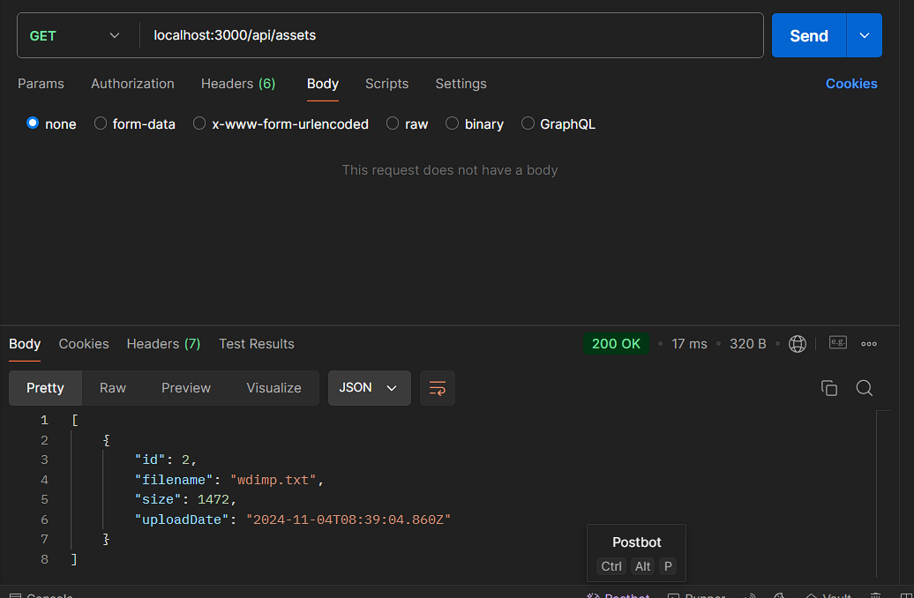
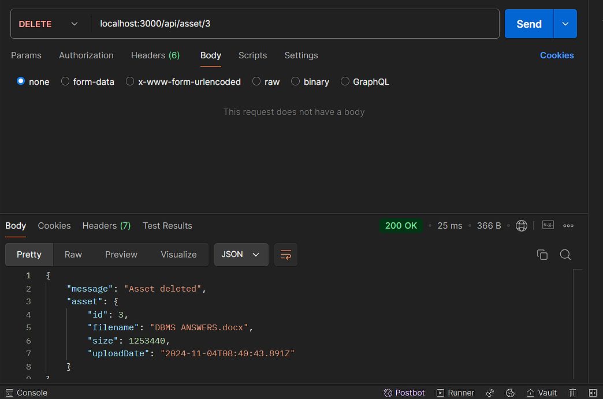

# Asset Management API

This API allows for managing assets, including uploading, listing, and deleting assets.

## Endpoints

### Upload an Asset
- **POST** `/api/upload`
  - Uploads a file and stores its metadata (filename, size, upload date) in the database.
  - Send the requests like give below to test the server.
  

### Retrieve All Assets
- **GET** `/api/assets`
  - Retrieves a list of all uploaded assets with their metadata.
  - Send the requests like give below to test the server.
  

### Delete an Asset
- **DELETE** `/api/asset/{id}`
  - Deletes a specific asset by its ID.
  - Send the requests like give below to test the server.
  

